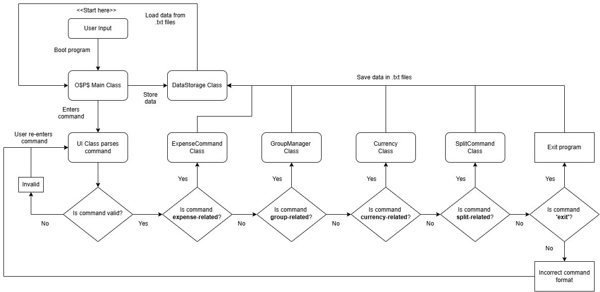
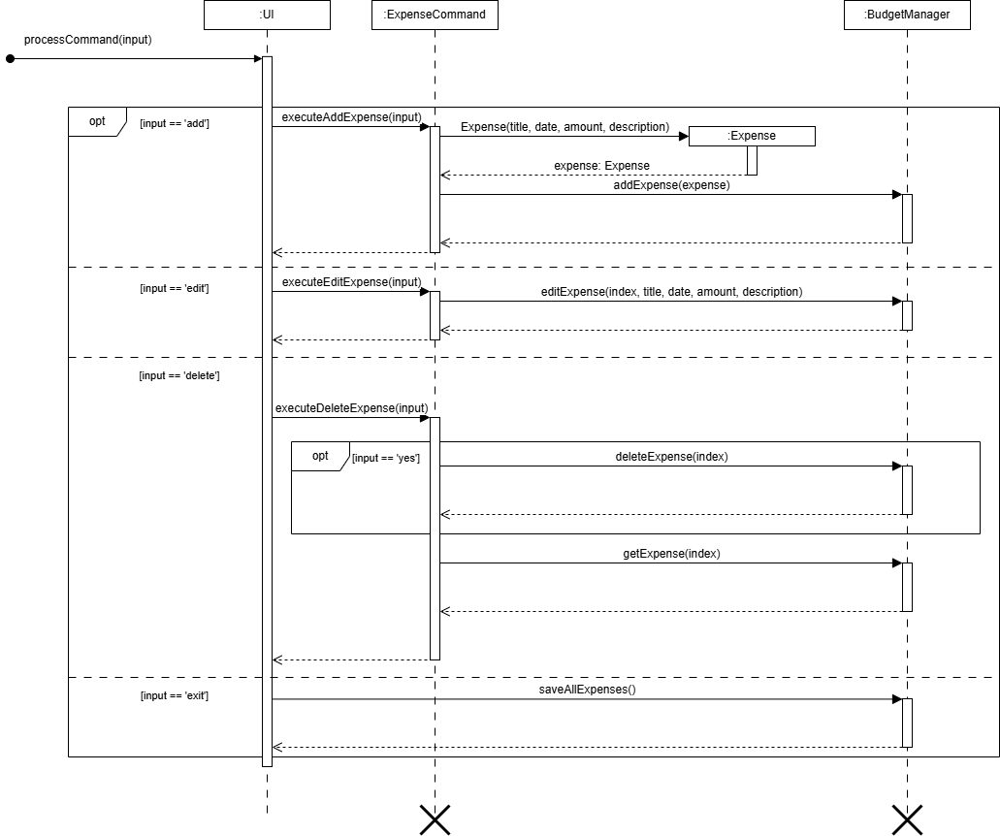
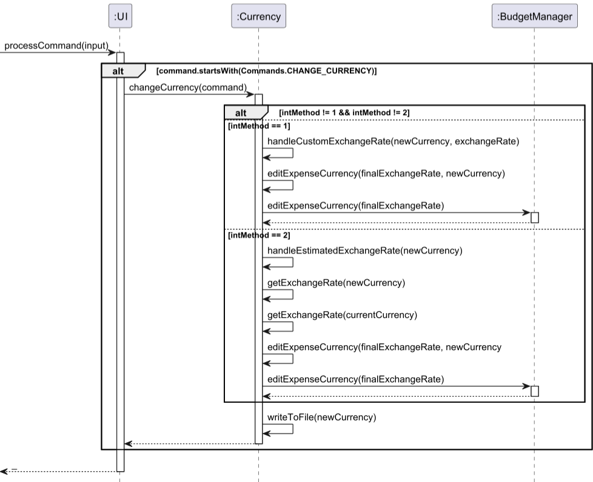
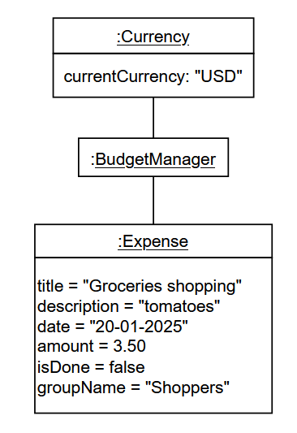

# Developer Guide

---

## Table of Contents

---

[1. Introduction](#1-introduction) <br>
[2. Setup Guide](#2-setup-guide) <br>
&nbsp;&nbsp;[2.1 Prerequisites](#21-prerequisites) <br>
[3. Design](#3-design) <br>
&nbsp;&nbsp;[3.1.0 UI Class](#310-ui-class) <br>
&nbsp;&nbsp;[3.1.1 DataStorage Class](#311-datastorage-class) <br>
&nbsp;&nbsp;[3.1.2 GroupStorage Class](#312-groupstorage-class) <br>
&nbsp;&nbsp;[3.1.3 Commands Class](#313-commands-class) <br>
&nbsp;&nbsp;[3.1.4 ExpenseCommands Classes](#314-expensecommands-classes) <br>
&nbsp;&nbsp;[3.1.5 FriendsCommands Class](#315-friendscommands-class) <br>
&nbsp;&nbsp;[3.1.6 SplitCommand Class](#316-splitcommand-class) <br>
&nbsp;&nbsp;[3.1.7 BudgetManager Class](#317-budgetmanager-class) <br>
&nbsp;&nbsp;[3.1.8 Expense Class](#318-expense-class) <br>
&nbsp;&nbsp;[3.1.9 Friend Class](#319-friend-class) <br>
&nbsp;&nbsp;[3.2.0 Group Class](#320-group-class) <br>
&nbsp;&nbsp;[3.2.1 GroupManager Class](#321-groupmanager-class) <br>
&nbsp;&nbsp;[3.2.2 Messages Class](#322-messages-class) <br>
&nbsp;&nbsp;[3.2.3 Summary Class](#323-summary-class) <br>
&nbsp;&nbsp;[3.2.4 ExpenseClassifier Class](#324-expenseclassifier-class) <br>
&nbsp;&nbsp;[3.2.5 Currency Class](#325-currency-class) <br>
[4. Overall Application Architecture](#4-overall-application-architecture) <br>
&nbsp;&nbsp;[4.1 Application Class Diagram](#41-application-class-diagram) <br>
&nbsp;&nbsp;[4.2 Expense CRUD Feature](#42-expense-crud-feature) <br>
&nbsp;&nbsp;[4.3 Split Expense Feature](#44-split-expense-feature) <br>
&nbsp;&nbsp;[4.4 Change Currency Feature](#45-change-currency-feature) <br>
&nbsp;&nbsp;[4.5 Data Visualization Feature](#46-data-visualization-feature) <br>
[5. Appendix](#5-appendix) <br>
&nbsp;&nbsp;[5.1 Product Scope](#51-product-scope) <br>
&nbsp;&nbsp;&nbsp;&nbsp;[5.1.1 Target User Profile](#511-target-user-profile) <br>
&nbsp;&nbsp;&nbsp;&nbsp;[5.1.2 Value Proposition](#512-value-proposition) <br>
&nbsp;&nbsp;[5.2 User Stories](#52-user-stories) <br>
&nbsp;&nbsp;[5.3 Non-Functional Requirements](#53-non-functional-requirements) <br>
&nbsp;&nbsp;[5.4 Glossary](#54-glossary) <br>

## Acknowledgements

All our UML diagrams are created using draw.io.

---

## 1. Introduction

---

O\$P\$ is an expense-tracker application that allows
the user to keep track of their expenditure with ease!
Users can also manage expenses in a group setting with
simple splitting functions, as well as view analytics
of their spending across multiple categories.

## 2. Setup Guide

---

### 2.1 Prerequisites

1.  Ensure you have Java 17 or above installed on your PC. **[Version 17 is preferred]**
2.  You may download [here](https://se-education.org/guides/tutorials/javaInstallationMac.html) for Mac users and [here](https://www.oracle.com/sg/java/technologies/downloads/) for Windows users.
3.  If you have it installed already, you may check it by running `java -version` in your terminal.
4.  Download the latest `.jar` file from here. **[link will be updated once v1 is ready]**
5.  Copy the file to the folder you want to use as the home folder for your **O\$P$ budget tracking app** 🙂.
6.  Open a command terminal, `cd` into the folder you put the jar file in, and use the `java -jar tp.jar` command to run the application.
7.  Type the command in the command box and press **Enter** to execute it.
8.  **Example:** Typing `help` and pressing **Enter** will open a mini window showing a list of all possible commands.
9.  Refer to the [features](https://docs.google.com/document/d/125Cg7wzuc4XFo3wsziwL2f64KN1uUfvFL5dIm6IQrSk/edit?tab=t.xl7ogrtj0a5q#heading=h.61o02m6y9xrc) section below for details on all commands and functionalities.

---

## 3. Design

---

### 3.1.0 UI Class

This class displays system output messages whenever an action has occurred or invoked by the user using the listed commands.

### Methods

#### `handleUserInput()`

This method continuously prompts the user for input and processes commands accordingly. It ensures that the application runs until the user chooses to exit.

#### Functionality:

1. Displays a prompt for the user to enter a command.
2. Reads user input if available.
3. Calls `processCommand` to handle the command.
4. Displays a divider after processing each command (if still running).
5. If no input is available, it displays an empty input message and stops execution.

### `processCommand()`

This method processes user input by mapping commands to their corresponding functionalities. The commands are predefined in the `Commands` class.

#### Functionality:

1. Trims and converts user input to lowercase.
2. Uses a `switch` statement to execute the appropriate method based on the input.
3. Handles multiple functionalities, including expense management, group operations, currency conversion, and data export.
4. Displays an error message for invalid commands.

### 3.1.1 DataStorage Class

The data storage class initializes the expense.txt file to store expenses created by the user on app start-up and its contents
are saved upon exit.

### File Handling

- **Data File:** The expense data is stored in `expenses.txt`.
- **Separator:** Each entry in the file is delimited using `|`.
- **Assertions:** Used to ensure correct program behavior.

### Methods

#### `ensureFileExists()`

Ensures that the data file exists. If the file does not exist, it is created.

- Uses `File.createNewFile()`.
- Prints a message if a new file is created.
- Handles `IOException` in case of errors.
- Assertion: Checks that the file exists after execution.

#### `saveExpenses(List<Expense> expenses)`

Saves a list of expenses to the data file.

- Iterates through `expenses` and writes each expense to `expenses.txt`.
- Each expense is stored with attributes separated by `|`.
- Returns `true` if saving is successful, `false` otherwise.
- Handles `IOException`.
- Assertion: Ensures `expenses` is not null before execution.

#### `loadExpenses()`

Loads expenses from the data file.

- Reads each line and splits it using `|`.
- Extracts attributes and creates `Expense` objects.
- Returns a list of `Expense` objects.
- Handles `FileNotFoundException`.

#### `resetExpenses()`

Clears all data in `expenses.txt`. Used mainly for testing.

- Writes an empty string to the file.
- Handles `IOException`.
- Assertion: Ensures the file is empty after reset.

### 3.1.2 GroupStorage Class

User-created groups are stored here, each containing the names of the members to be assigned an expense.

### 3.1.3 Commands Class

All approved commands that can be used within the application are stored here as macros. The UI class contains a switch-case block
that checks if the user input matches any of these commands and handles invalid commands.

#### Command List

Below are the commands supported by the application:

| Command            | Description                                    |
| ------------------ | ---------------------------------------------- |
| `HELP`             | Displays the list of available commands.       |
| `EXIT`             | Exits the application.                         |
| `ADD`              | Adds a new expense.                            |
| `LIST`             | Displays all recorded expenses.                |
| `DELETE`           | Deletes an expense.                            |
| `EDIT`             | Edits an existing expense.                     |
| `BALANCE`          | Shows the balance overview.                    |
| `SETTLED_LIST`     | Displays a list of settled expenses.           |
| `UNSETTLED_LIST`   | Displays a list of unsettled expenses.         |
| `MARK`             | Marks an expense as settled.                   |
| `UNMARK`           | Unmarks an expense as unsettled.               |
| `CREATE_GROUP`     | Creates a new group for expense sharing.       |
| `VIEW_GROUP`       | Views details of a specific group.             |
| `ADD_MEMBER`       | Adds a member to an existing group.            |
| `REMOVE_MEMBER`    | Removes a member from a group.                 |
| `REMOVE_GROUP`     | Deletes an entire group.                       |
| `VIEW_ALL_GROUPS`  | Displays all user-created groups.              |
| `SPLIT`            | Splits expenses among group members.           |
| `CHANGE_CURRENCY`  | Changes the default currency for transactions. |
| `DEFAULT_CURRENCY` | The default currency (SGD).                    |
| `SUMMARY`          | Displays an expense summary.                   |
| `EXPORT`           | Exports expense summary data.                  |

### 3.1.4 ExpenseCommands Classes

The ExpenseCommand class handles all expense-related operations in the application. It provides functionality for adding, deleting, editing, and managing expenses.

#### **Adding Expenses**

The `executeAddExpense()` method manages the addition of new expenses with the following features:

- Ensures the user input follows the correct format (`add/<title>/<category>/<date>/<amount>`). If the format is invalid, it prompts the user with the correct usage instructions.
- Performs comprehensive validation of all input fields:
  - Checks that none of the required fields (title, category, date, amount) are empty.
  - Validates that the provided title is unique among existing expenses.
  - Verifies the category is one of the valid predefined categories (Food, Shopping, Travel, Entertainment, Miscellaneous).
  - Ensures the date adheres to the `DD-MM-YYYY` format and represents a valid calendar date (with proper days per month and leap year handling).
  - Validates that the amount is a valid number, not negative, and not zero.
  - Checks that the amount does not exceed the maximum allowed limit of 50,000 SGD (or its equivalent in other currencies).
- Constructs a new `Expense` object with the validated inputs and adds it to the `budgetManager`. Upon success, it displays the added expense details.
- Implements robust error handling for all validation steps, providing clear error messages to guide the user.

#### Editing Expenses

The `executeEditExpense()` method manages the editing of existing expenses with the following features:

- Ensures the user input follows the correct format (`edit/<expense ID>/<new title>/<new category>/<new date>/<new amount>`). If the format is invalid, it prompts the user with the correct usage instructions.
- Validates that the expense ID is not empty and is a valid number within the range of existing expenses.
- Allows users to skip updating specific fields (title, category, date, or amount) by entering `"x"`. This flexibility ensures only desired fields are modified.
- Performs the same validation on the provided fields as during addition:
  - For categories, verifies it's one of the predefined valid categories.
  - For dates, ensures it adheres to the `DD-MM-YYYY` format and represents a valid calendar date.
  - For amounts, validates that it's a valid number, not negative, and not zero, while also checking against the maximum allowed limit.
- Calls the `budgetManager.editExpense()` method to apply the changes to the specified expense and displays the updated details upon success.
- Implements comprehensive error handling for all validation steps and edge cases, including invalid input formats and out-of-range values.

#### **Deleting Expenses**

The `executeDeleteExpense()` method manages the deletion of existing expenses with the following features:

- Ensures the user input follows the correct format (`delete/<expense ID>`). If the format is invalid, it prompts the user with the correct usage instructions.
- Converts the provided expense ID to a zero-based index and checks if it falls within the valid range of existing expenses. If the index is invalid, it notifies the user to enter a valid expense number.
- Displays the expense details and asks the user to confirm the deletion (`y/n`). If the user does not confirm, the deletion is aborted.
- Calls the `budgetManager.deleteExpense()` method to remove the specified expense. The deleted expense is displayed upon success.
- Updates the `owesData.txt` file to reflect any changes in owed amounts due to the deletion.
- Catches and handles exceptions such as `NumberFormatException` (for invalid expense IDs), `IndexOutOfBoundsException` (for out-of-range indices), and general exceptions to provide meaningful feedback to the user.
- Ensures the internal state remains consistent by validating the existence of the expense before deletion.

#### Displaying Settled Expenses

The `displaySettledExpenses()` method manages the display of settled expenses with these features:

- Retrieves all expenses from budgetManager before filtering
- Checks for empty expense lists and displays an appropriate message
- Prints the current currency to ensure user is aware which currency the amounts are printed in
- Iterates through the expense list while filtering for settled expenses
- Handles edge cases gracefully, such as no settled expenses found
- Uses proper singular/plural formatting for the summary output

#### Displaying Unsettled Expenses

The `displayUnsettledExpenses()` method manages the display of unsettled expenses with these features:

- Retrieves all expenses from budgetManager before filtering
- Checks for empty expense lists and displays an appropriate message
- Prints the current currency to ensure user is aware which currency the amounts are printed in
- Iterates through the expense list while filtering for unsettled expenses
- Handles edge cases gracefully, such as no unsettled expenses found
- Uses proper singular/plural formatting for the summary output

#### Marking Expenses

The `executeMarkCommand(String command)` method manages marking an expense as settled with these features:

- Attempts to mark the specified expense using budgetManager.markExpense()
- Handles invalid indices gracefully with an IndexOutOfBoundsException
- Handles non-numeric input with a NumberFormatException
- Provides clear error messages to guide the user toward valid input

#### Unmarking Expenses

The `executeUnmarkCommand(String command)` method manages unmarking an expense as unsettled with these features:

- Attempts to unmark the specified expense using budgetManager.unmarkExpense()
- Handles invalid indices gracefully with an IndexOutOfBoundsException
- Handles non-numeric input with a NumberFormatException
- Provides clear error messages to guide the user toward valid input

#### Finding Specific Expenses

The `findExpense()` method in the `seedu.duke.budget` package is responsible for searching and displaying expenses that match a given keyword. It helps users efficiently locate expenses by title or description.

- Prompts the user to enter a keyword to search for expenses.
- Validates that the keyword is not empty.
- Retrieves all stored expenses using `budgetManager.getAllExpenses()`.
- Filters expenses whose title or description contains the keyword (case-insensitive).
- Displays the list of matching expenses, if any.

#### Expense Summaries

The class provides comprehensive expense summary functionality:

1. Viewing Summaries:

   - Supports multiple view types with proper validation:
     - Monthly Summary (`summary/BY-MONTH/N`): Shows total expenses and count per month
     - Category-wise Summary (`summary/BY-CATEGORY/Y` or `summary/BY-CATEGORY/N`): Shows total expenses and count per category
   - Validates the command format, ensuring it contains all required parameters (view type and visualization option)
   - Enforces view-specific restrictions (e.g., BY-MONTH view only supports the N option without visualization)
   - Validates that the visualization choice is either Y or N
   - Gracefully handles empty expense lists with appropriate messages
   - Processes multiple months or categories correctly when displaying data

2. Exporting Summaries:

   - Export to text files (monthly_summary.txt, category_summary.txt)
   - Same formatting as view summaries
   - Error handling for file operations
   - Confirmation messages for successful exports

3. Data Organization:
   - Uses Maps to group and aggregate expenses
   - Maintains both totals and counts
   - Sorts data for better readability
   - Handles empty expense lists gracefully

#### Error Handling

Both methods implement comprehensive error handling:

- NumberFormatException for invalid number inputs
- IndexOutOfBoundsException for invalid indices
- FileNotFoundException for file operations
- General exception handling with user-friendly messages

#### Data Validation

The class uses assertions to validate:

- Non-null objects
- Valid indices
- Non-negative amounts
- Valid expense states

### 3.1.5 FriendsCommands Class

The FriendsCommands class handles all friends and groups related operations in the application. It provides functionality for adding, deleting, and managing friend groups.

#### Checking if a group/member name is valid

The `isValidName()` method is a utility function used to validate input strings for group names and member names. It ensures that the input follows specific naming conventions and helps maintain data integrity.

- **Input validation:**

  - Accepts a single `String` parameter `name`.

- **Null and empty check:**

  - Method checks if the input is `null` or an empty string after trimming the whitespace.
  - If either condition is met, the method returns `false`.

- **Name format validation**
  - Uses a regular expression to validate that the name contains only letters (both uppercase and lowercase), numbers, and spaces.
  - If all conditions are met, the method returns `true`
  - If even one is violated, it returns `false`.

#### Creating a new group

The `createGroup()` method is responsible for creating a new group within the application. It follows a user-driven input process to define the group name and add members.

- **Group name Input:**

  - The method prompts the user to enter a group name.
  - The input is validated using the `isValidName()` method.
  - If name is invalid, the user is prompted to enter a name again.

- **Adding Group Members:**

  - Once a valid group name is added, user is prompted to add members.
  - User can continue to input multiple member names, each name is validated by the `isValidName()` method.
  - Process continues until user types 'done'.
  - Each valid member name is used to create a new `Friend` object, which is then added to the group using `groupManager.addFriendToGroup()`.

- **Saving the Group:**
  - Once the group creation is complete, the method saves the group using `groupManager.saveGroups()`
  - A success message is displayed upon creation.

#### Remove a Group

The `removeGroup()` is used to delete an entire group from the group management system.

- **Input:**

  - Prompts the user to enter the name of the group they want to remove.
  - Trims any leading or trailing whitespaces from the input.

- **Group Existence Check:**

  - Uses `groupManager.groupExists(groupName)` to verify whether the specified group exists.
  - If group does not exist, the method prints "Group does not exist."

- **Delete confirmation:**

  - Before removal, the method prompts the user to confirm: "Are you sure you want to remove [groupName]? (y/n)"
  - If the user does not input "y", the operation to remove is cancelled.

- **Group Removal:**
  - If confirmed, the method calls `groupManager.removeGroup(groupName)` to remove the group from the group management system.
  - The updated group list is saved using `groupManager.saveGroups()`.

#### Viewing the Transactions of a Member in a Group

The `viewMember()` method is responsible for displaying the transactions of a particular member in a group. It lists all the expenses owed/attributed to the particular user. It is useful to track and log the expenses.

- **Input:**

  - Prompts user to enter the member name and group name.
  - Trims any extra whitespaces from the input.

- **Group Existence Check:**

  - Checks whether the group exists, and whether the entered member name is part of the mentioned group.

- **Loading Expense Data:**

  - The method reads from the `owedAmounts.txt` file, which contains expense data.
    -For each transaction, it will print out the relevant transaction.
  - It also processes malformed data and skips it.

#### Viewing an existing group

The `viewGroup()` method is responsible for displaying the details of a specific group, it includes its members and associated expenses.
This method is essential for users who wish to view group details and any expenses related to group members.

- **Input:**

  - Prompts user to enter the group name that they want to view.
  - Trims any extra whitespaces from the input.

- **Group Existence Check:**

  - Uses the `groupManager.groupExists()` method to check whether the specified group exists.
  - If the group does not exist, the method prints a "Group not found" message and terminates.

- **Loading Expense Data:**

  - The method reads from the `owedAmounts.txt` file, which contains expense data.
  - It loads this data into a map owedAmounts, where:
    - The key is the member's name.
    - The value is the accumulated amount they owe.
  - The method ensures that the amounts are accumulated for each member instead of being overwritten.

- **Display Group Members and Expenses:**
  - Uses groupManager.getGroupMembers(groupName) to fetch the list of group members.
  - If the group has no members, it displays "No members in this group."
  - For each member, it:
    - Retrieves their name.
    - Checks the owedAmounts map for any recorded expenses.
    - Displays the member's name along with the accumulated expense amount.
  - If a member has no recorded expense, the amount displayed is 0.00.

#### Viewing all user's Groups

The `viewAllGroups()` method is designed to display a list of all the groups that the user has created or is a part of. It provides a quick overview of the existing groups managed by the application.

- **Check for existing groups:**

  - Uses `groupManager.getGroups()` to retrieve a list of all groups.
  - If the list is empty, the method prints "You have no groups".

- **Displaying Groups:**
  - If the list is not empty, the method iterates over each group and prints its details using the `toString()` method of the Group class.
  - This allows the user to see a comprehensive list of all group names and any other associated information that the Group class's `toString()` method returns.

#### Viewing group directly

#### Add a member

The `addMember()` method allows the user to add a new member to an existing group. If the specified group does not exist, the method offers the option to create the group and add the member simultaneously.

- **Input:**

  - Member name:
    - Prompts the user to enter the name of the member they want to add.
    - Uses isValidName() to validate the input, ensuring it does not contain special characters or empty spaces.
    - Repeats the prompt until a valid name is entered.
  - Group name:
    - Prompts the user to enter the group name to which the member should be added.
    - Similarly, the name is validated to avoid empty or invalid names.

- **Group Existence Check:**

  - Uses `groupManager.groupExists(groupName)` to verify whether the specified group already exists.

- **Adding Member to existing group:**

  - If the group exists:
    - Uses `groupManager.addFriendToGroup(groupName, new Friend(name, groupName))` to add the member.
    - Calls `groupManager.saveGroups()` to save the updated group data.
    - Displays a success message indicating that the member has been added to the group.

- **Handling non-existent groups:**
  - If the group does not exist:
    - Asks the user if they would like to create the group.
  - If the user enters "y":
    - Creates the group and adds the member directly.
    - Saves the new group and member data.
    - Displays a message confirming the creation and addition.
  - If the user enters "no":
    - Cancels the operation and notifies the user that the member was not added.

#### Remove a member

The `removeMember()` method allows the user to add a new member to an existing group. If the specified group does not exist, the method offers the option to create the group and add the member simultaneously.

- **Input:**

  - Member name:
    - Prompts the user to enter the name of the member they want to remove.
    - Trims any leading or trailing whitespaces from the input.
  - Group name:
    - Prompts the user to enter the group name to which the member should be removed.
    - Trims whitespace for the input.

- **Group Existence Check:**

  - Uses `groupManager.groupExists(groupName)` to verify whether the specified group exists.
  - If group does not exist, the method prints "Group does not exist."

- **Delete confirmation:**

  - Before removal, the method prompts the user to confirm: "Are you sure you want to remove [memberName] from [groupName]? (y/n)"
  - If the user does not input "y", the operation to remove is cancelled.

- **Member Removal:**
  - If confirmed, the method iterates through the list of groups returned by `groupManager.getGroups()`.
  - Locates the specified group by comparing the group name.
  - Uses the `removeFriend()` method to attempt to remove the specified member from the group.
  - If successful, it sets the removed flag to true and breaks out of the loop.

### 3.1.6 SplitCommand Class

The SplitCommand class is responsible for splitting a selected expense among members of a specified group.
It accepts a unified command in the following format:

`split/<equal or assign>/<expense index>/<group name>`

- **Equal Split:**  
  Divides the total expense amount equally among all group members.

- **Manual Split:**  
  Allows the user to specify individual shares using either absolute amounts or percentages. After entering the command, the user is prompted to choose a method (`/a` for absolute amounts or `/p` for percentages) and to input the share for each member. The system validates the input and ensures that the full expense is allocated.

- **Duplicate Prevention:**  
  Before proceeding, the class checks the transaction log to ensure that the same expense has not already been split for the specified group. If a duplicate is detected, the split is aborted and an error message is displayed.

- **Error and Exception Handling:**  
  Before proceeding, the parser also checks to ensure that all the input is valid and raises the appropriate exceptions. This check is done for negative index, NULL, and other invalid inputs and parameters.

- **Transaction Logging:**  
  For every split operation, detailed transaction records are created in the format:  
  `Transaction: Expense: <title>, Date: <date>, Group: <group>, Member: <member> owes: <amount>`

#### Methods

#### `SplitCommand(Scanner scanner, GroupManager groupManager, FriendsCommands friendsCommands)`

Initializes the `SplitCommand` instance with the provided dependencies.

- Asserts that all constructor arguments are non-null.
- Stores references to interact with groups and prompt the user.

#### `executeSplit()`

Executes the flow for splitting an expense. Follows the format as required above:

`split/<equal or assign>/<expense index>/<group name>`

- Prompts the user to choose:
  - `[1]` Equal Split
  - `[2]` Manual Split
  - `[x]` Cancel
- Displays available expenses and validates the selected index.
- Retrieves group and validates its existence and membership.
- Delegates to the chosen split method:

  - **Equal Split:**

    - Divides total amount equally among all members.
    - Appends individual owed shares to the transaction log.

  - **Manual Split:**
    - Prompts user to choose between absolute amounts (`/a`) or percentages (`/p`).
    - **Manual Split – Absolute:**
      - Prompts for each member's assigned amount.
      - Tracks remaining amount and prevents over-allocation.
      - Logs each owed amount to storage.
    - **Manual Split – Percentage:**
      - Prompts for each member's share percentage.
      - Computes owed amount as `totalAmount * (percentage / 100)`.
      - Validates total assigned percentages.

- Calls `friendsCommands.viewGroupDirect()` to update group display after split.

#### Internal Logic (within `executeSplit()`)

- **Equal Split:**

  - Computes `share = totalAmount / numMembers`.
  - Loops through group members and logs each person's owed amount.
  - Writes each owed entry to `OwesStorage`.

- **Manual Split – Absolute:**

  - Prompts for each member's assigned amount.
  - Tracks remaining amount and prevents over-allocation.
  - Logs each owed amount to storage.

- **Manual Split – Percentage:**
  - Prompts for each member's share percentage.
  - Computes owed amount as `totalAmount * (percentage / 100)`.
  - Validates total assigned percentages.

Below is the UML sequence diagram for the `SplitCommand` class.


### 3.1.7 BudgetManager Class

The `BudgetManager` class manages a collection of expenses and provides operations to add, delete, edit, and retrieve expenses. It also integrates with the `DataStorage` class to persist expense data.

#### Expense Management

- **Storage:** Expenses are stored in a list and persisted in `expenses.txt` via `DataStorage`.
- **Validation:** Index checks ensure operations are performed on valid expenses.
- **Assertions:** Used to verify that expense counts and modifications are logically sound.

#### Methods

#### `BudgetManager()`

Initializes the `BudgetManager` with a list of expenses loaded from storage.

- Calls `DataStorage.loadExpenses()` to retrieve stored expenses.
- Initializes the `expenses` list.

#### `addExpense(Expense expense)`

Adds an expense to the list and saves it to storage.

- Appends the given `Expense` object to `expenses`.
- Calls `DataStorage.saveExpenses(expenses)`.

#### `deleteExpense(int index)`

Deletes an expense at the specified index.

- Validates the index before removal.
- Calls `DataStorage.saveExpenses(expenses)` after deletion.
- Returns the deleted `Expense`.
- Throws `IndexOutOfBoundsException` for invalid indices.

#### `editExpense(int index, String title, String description, String date, double amount)`

Modifies the attributes of an expense at the given index.

- Updates only non-null fields (title, description, date, amount).
- Calls `DataStorage.saveExpenses(expenses)` after modification.
- Throws `IndexOutOfBoundsException` if the index is invalid.

#### `getAllExpenses()`

Returns a copy of the list of all stored expenses.

- Prevents direct modification by returning a new `ArrayList`.

#### `getExpenseCount()`

Returns the total number of recorded expenses.

#### `getUnsettledExpenseCount()`

Counts the number of unsettled expenses.

- Iterates through `expenses` and counts those where `getDone()` is false.
- Assertion: Ensures count is non-negative.

#### `getTotalBalance()`

Calculates the total amount of unsettled expenses.

- Sums up the amounts of expenses where `getDone()` is false.
- Returns the total balance.

#### `getExpense(int index)`

Retrieves an expense at the specified index.

- Throws `IndexOutOfBoundsException` if index is invalid.

#### `markExpense(int index)`

Marks an expense as settled.

- Updates `setDone(true)` for the given expense.
- Saves the updated list using `saveAllExpenses()`.
- Throws `IndexOutOfBoundsException` for invalid indices.

#### `unmarkExpense(int index)`

Unmarks an expense, making it unsettled.

- Updates `setDone(false)` for the given expense.
- Saves the updated list using `saveAllExpenses()`.
- Throws `IndexOutOfBoundsException` for invalid indices.

#### `editExpenseCurrency(Double finalExchangeRate)`

Applies a currency exchange rate to all expenses.

- Multiplies each expense's amount by the exchange rate.
- Calls `editExpense()` to update each expense.
- Skips execution if `expenses` is empty.

#### `saveAllExpenses()`

Saves all expenses to persistent storage.

- Calls `DataStorage.saveExpenses(expenses)`.

### 3.1.8 Expense Class

The `Expense` class in the `seedu.duke.expense` package represents an individual expense with attributes such as title, description, date, amount, completion status, and associated group name. It encapsulates all necessary details for managing and tracking expenses.

#### Expense Initialization

- **Constructors:**
  - `Expense(String title, String description, String date, double amount)`
    - Initializes the `title`, `description`, `date`, and `amount` fields with the provided values.
    - Sets the default completion status (`isDone`) to `false`.
  - `Expense(String title, String description, String date, double amount, boolean isDone)`
    - Initializes the `title`, `description`, `date`, `amount`, and `isDone` fields with the provided values.
    - Allows specifying whether the expense is marked as completed during initialization.

#### Getting and Setting Attributes

- **Title:**

  - **Method:** `getTitle()`
    - Returns the title of the expense.
    - Provides a way to access the short name or summary of the expense.
  - **Method:** `setTitle(String title)`
    - Updates the title of the expense.
    - Enables modification of the expense's summary.

- **Description:**

  - **Method:** `getDescription()`
    - Returns the description of the expense.
    - Provides detailed information about the expense.
  - **Method:** `setDescription(String description)`
    - Updates the description of the expense.
    - Allows modifying the detailed information.

- **Date:**

  - **Method:** `getDate()`
    - Returns the date of the expense.
    - Provides the date when the expense was incurred.
  - **Method:** `setDate(String date)`
    - Updates the date of the expense.
    - Enables correction or adjustment of the expense date.

- **Amount:**

  - **Method:** `getAmount()`
    - Returns the monetary value of the expense.
    - Provides the expense amount for calculations or display.
  - **Method:** `setAmount(double amount)`
    - Updates the monetary value of the expense.
    - Allows modifying the expense amount.

- **Completion Status:**

  - **Method:** `getDone()`
    - Returns the completion status of the expense (`true` if completed, `false` otherwise).
    - Indicates whether the expense has been settled or marked as done.
  - **Method:** `setDone(Boolean isDone)`
    - Updates the completion status of the expense.
    - Allows marking the expense as completed or uncompleted.

- **Group Name:**
  - **Method:** `getGroupName()`
    - Returns the name of the group associated with the expense.
    - Useful for organizing expenses by groups.
  - **Method:** `setGroupName(String groupName)`
    - Updates the group name associated with the expense.
    - Enables assigning the expense to a specific group.

#### String Representation

- **Method:** `toString()`
  - Returns a string representation of the expense.
  - Includes the title, description, date, and formatted amount (to two decimal places).
  - Example Output:
    ```
    Title: Groceries
    Description: Weekly food shopping
    Date: 01-01-2025
    Amount: 100.00
    ```

#### Design Considerations

- The class follows the **Single Responsibility Principle (SRP)**, focusing solely on holding and managing expense-related data.
- Encapsulation is maintained through private attributes and public getter/setter methods.
- Default values (e.g., `isDone = false`) ensure consistency and simplify initialization.
- The inclusion of optional fields (e.g., `groupName`) provides flexibility for advanced use cases like group-based expense tracking.
- The `toString()` method ensures a user-friendly representation of the expense, making it suitable for display purposes.

### 3.1.9 Friend Class

The `Friend` class in the `seedu.duke.friends` package represents an individual member within a group. It stores essential information about the friend, including their name and the group they belong to.

#### Friend Initialization

- **Constructor:** `Friend(String name, String group)`
- **Features:**
  - Initializes the `name` and `group` fields with the provided values.
  - Represents a friend as part of a specific group.

#### Getting Friend's Name

- **Method:** `getName()`
- **Features:**
  - Returns the name of the friend.
  - Provides a way to access the friend's name for display or processing.

#### Getting Friend's Group

- **Method:** `getGroup()`
- **Features:**
  - Returns the group to which the friend belongs.
  - Useful for organizing friends by their associated groups.

#### Design Considerations

- The class follows the **Single Responsibility Principle (SRP)**, focusing solely on holding friend-related data.
- Encapsulation is maintained through private attributes and public getter methods.
- The class is designed to be lightweight and efficient for group management operations.

### 3.2.0 Group Class

The `Group` class in the `seedu.duke.friends` package manages a collection of `Friend` objects under a specified group name.

#### Group Initialization

- **Constructor:** `Group(String name)`
- **Features:**
  - Sets the group name.
  - Initializes an empty list of `Friend` objects.

#### Adding Friends

- **Method:** `addFriend(Friend friend)`
- **Features:**
  - Adds a `Friend` object to the group.

#### Removing Friends

- **Method:** `removeFriend(String friendName)`
- **Features:**
  - Searches for the first friend with a matching name and removes them.
  - Returns `true` if removal is successful; otherwise returns `false`.
  - Note: Uses a for-each loop for removal, which may require caution regarding concurrent modifications.

#### Retrieving Friends

- **Method:** `getFriends()`
- **Features:**
  - Returns the list of `Friend` objects in the group.

#### Getting Group Name

- **Method:** `getName()`
- **Features:**
  - Returns the group's name.

#### String Representation

- **Method:** `toString()`
- **Features:**
  - Constructs a formatted string showing the group name and member names.
  - If the group is empty, calls `messages.displayEmptyGroupMessage()` to display an appropriate message.
  - **Important:** Ensure that the `messages` field is initialized externally to prevent a `NullPointerException`.

### 3.2.1 GroupManager Class

The `GroupManager` class in the `seedu.duke.friends` package is responsible for managing groups and their members. It provides methods to add members, check group existence, retrieve group members, remove groups, and persist group data.

#### GroupManager Initialization

- **Constructor:** `GroupManager()`
- **Features:**
  - Initializes the list of groups by loading existing groups from the storage using `GroupStorage.loadGroups()`.
  - Uses the `Messages` object to display user messages.

---

#### Adding a Friend to a Group

- **Method:** `addFriendToGroup(String groupName, Friend friend)`
- **Features:**
  - Searches for an existing group with the given name.
  - If found, adds the `Friend` object to that group.
  - If not found, creates a new group with the specified name and adds the friend.
  - Ensures that the group is updated efficiently by adding the friend directly to the existing group if possible.

---

#### Checking Group Existence

- **Method:** `groupExists(String groupName)`
- **Features:**
  - Iterates through the list of groups to check whether a group with the specified name exists.
  - Returns `true` if the group is found, otherwise returns `false`.

---

#### Retrieving Group Members

- **Method:** `getGroupMembers(String groupName)`
- **Features:**
  - Searches for the specified group by name.
  - If found, returns a list of `Friend` objects from that group.
  - If not found, returns an empty list to indicate that the group does not exist.

---

#### Removing a Group

- **Method:** `removeGroup(String groupName)`
- **Features:**
  - Removes the specified group using a `removeIf` lambda function for efficiency.
  - If the group is successfully removed, it calls `saveGroups()` to persist changes.
  - Displays a success message if the group is deleted, otherwise uses `messages.displayMissingGroupMessage()` to indicate that the group was not found.

---

#### Saving Groups

- **Method:** `saveGroups()`
- **Features:**
  - Saves the current list of groups to the storage using `GroupStorage.saveGroups(groups)`.
  - Ensures that changes made to group structures are persistent across application sessions.

---

#### Retrieving All Groups

- **Method:** `getGroups()`
- **Features:**
  - Returns the current list of groups.
  - Useful for displaying all available groups in the application.

---

#### Design Considerations

- The class follows the **Single Responsibility Principle (SRP)**, focusing on group management while delegating storage operations to the `GroupStorage` class.
- Ensures that any modification to the group list is followed by a save operation to maintain data consistency.
- Uses the **Strategy Pattern** for loading and saving groups, allowing flexibility in storage implementations.
- Avoids group duplication by checking for existing groups before adding a

### 3.2.2 Messages Class

The `Messages` class provides standardized system messages for user interaction within the O$P$ expense-tracker application. It includes messages for system events, errors, user prompts, and notifications.

### Methods

#### `displayWelcomeMessage()`

Displays a welcome message when the application starts.

- Outputs: "Welcome to O$P$ expense-tracker! How can I help you?"
- Calls `setDivider()` to format the output.

#### `enterCommandMessage()`

Prompts the user to enter a command.

- Outputs: "Enter command: "

#### `emptyInputMessage()`

Handles cases where the user provides no input.

- Outputs: "No input detected. Exiting program..."

#### `setDivider()`

Displays a horizontal divider for visual separation.

- Outputs: A line of 80 underscores.

#### `errorMessageTag()` _(static)_

Returns the error message prefix.

- Returns: "ERROR: "

#### `invalidIndexMessage()`

Displays an error message for an invalid expense index.

- Returns: "Invalid expense index."

#### `displayExitMessage()`

Displays a farewell message when the user exits the application.

- Outputs: "Thank you for using the Expense Manager. Goodbye!"

#### `displayInvalidCommandMessage()`

Displays an error message for invalid user commands.

- Outputs: "Invalid command."

#### `createNewFileMessage()` _(static)_

Notifies the user when a new file is created.

- Outputs: "Created a new file!"

#### `displayEmptyGroupMessage()`

Displays a message when attempting to access a group with no members.

- Returns: "No members in this group."

#### `displayMissingFileExceptionMessage()`

Displays an error message when the owed amounts file is missing.

- Outputs: "Owed amounts file not found. No amounts to display."

#### `displayInvalidAmountExceptionMessage()`

Handles errors when parsing owed amounts.

- Outputs: "Error parsing owed amounts. Some amounts may not be displayed."

#### `displayMissingGroupMessage()`

Displays an error message when the specified group is not found.

- Outputs: "Group not found."

#### `displayCommandList()`

Displays the list of available commands along with their descriptions and usage examples.

- Prints a formatted command list to the console.
- Groups related commands for clarity.
- Provides details about user input expectations.

### 3.2.3 Summary Class

The Summary functionality is implemented through the `ExpenseCommand` class, which provides comprehensive analytics through different views and export capabilities.

#### Key Features:

1. **Multiple Viewing Options:**

   - **Monthly View (`summary/BY-MONTH/N`):** Organizes expenses by month, showing totals and detailed expense listings for each month
   - **Category View (`summary/BY-CATEGORY/Y` or `summary/BY-CATEGORY/N`):** Groups expenses by category with the option to display visualization

2. **Data Visualization:**

   - Implements an interactive pie chart for category-wise summary using the XChart library
   - Displays percentages, amounts, and color-coded segments for each expense category
   - Provides tooltips and annotations with additional information
   - Includes proper cleanup of visualization resources when the application closes

3. **Export Functionality:**

   - Supports exporting summaries to text files via the `export/<type>` command
   - Where `<type>` can be either `monthly` or `category wise`
   - Monthly summaries are exported to `monthly_summary.txt`
   - Category-wise summaries are exported to `category_summary.txt`

4. **Data Processing:**
   - Uses `ExpenseClassifier` to calculate category proportions and counts
   - Groups expenses by month or category using Java's HashMap for efficient lookups
   - Handles empty expense lists and edge cases gracefully
   - Provides consistent formatting and currency display

#### Key Methods:

1. **`showExpenseSummary(String userInput)`**

   - **Purpose:** Main entry point for processing summary commands
   - **Parameters:** `userInput` - The command string from the user
   - **Functionality:**
     - Parses the input format (`summary/BY-MONTH/N` or `summary/BY-CATEGORY/{Y|N}`)
     - Validates command format and parameters
     - Delegates to appropriate summary method based on view type
     - Handles error cases and provides feedback to users
     - Ensures BY-MONTH view only supports non-visualization option

2. **`showMonthlySummary()`**

   - **Purpose:** Displays expenses grouped by month
   - **Functionality:**
     - Retrieves all expenses from the budget manager
     - Groups expenses by month using HashMap data structures
     - Calculates monthly totals and expense counts
     - Formats and displays a comprehensive monthly breakdown
     - Lists individual expenses under each month with details
     - Handles empty expense lists gracefully

3. **`showCategorySummary(boolean showVisualization)`**

   - **Purpose:** Displays expenses grouped by category
   - **Parameters:** `showVisualization` - Whether to show a pie chart
   - **Functionality:**
     - Retrieves all expenses from the budget manager
     - Uses `ExpenseClassifier` to calculate category totals and counts
     - Displays category-wise summary with amounts and expense counts
     - Optionally calls `showPieChart()` to display visualization
     - Prepares data for visualization by collecting category names and values

4. **`showPieChart(List<String> categoryNames, List<Number> categoryValues)`**

   - **Purpose:** Creates and displays an interactive pie chart visualization
   - **Parameters:**
     - `categoryNames` - List of category names to display
     - `categoryValues` - Corresponding monetary values for each category
   - **Functionality:**
     - Closes any existing chart windows to prevent resource leaks
     - Creates a pie chart using XChart library with professional styling
     - Calculates percentages for each category
     - Applies custom colors and formatting for visual clarity
     - Adds tooltips and annotations with total expense information
     - Creates and displays a JFrame window with the chart
     - Handles window events including proper cleanup on close
   - **Known Limitations:**
     - **IMPORTANT**: Due to a limitation in the XChart visualization API, users must close the pie chart window before exiting the program. If the visualization window remains open when attempting to exit, the application will not terminate properly. This is a known API issue and not a bug in the application.

5. **`exportExpenseSummary(String userInput)`**

   - **Purpose:** Handles exporting summaries to text files
   - **Parameters:** `userInput` - The command string from the user
   - **Functionality:**
     - Parses the input format (`export/<monthly | category wise>`)
     - Validates the export type parameter
     - Delegates to appropriate export method based on the specified type
     - Handles invalid formats and provides helpful error messages
     - Supports "monthly" and "category wise" export types

6. **`exportMonthlySummary()`** and **`exportCategorySummary()`**
   - **Purpose:** Export specific summary types to text files
   - **Functionality:**
     - Create and write to their respective output files
     - Format data consistently with the displayed summary
     - Handle file I/O operations with proper exception handling
     - Provide confirmation messages upon successful export
     - Handle edge cases like empty expense lists

#### Implementation:

- **Data Aggregation:**

  - Uses Maps to efficiently group expenses by month or category
  - Implements running totals and counts for statistical analysis
  - Maintains original expense objects for detailed reporting

- **Visualization Engine:**

  - Creates customized PieChart instances with professional styling
  - Implements consistent color coding for categories
  - Handles window management and proper cleanup of resources
  - Provides descriptive labels and tooltips for user interaction

- **Export Module:**
  - Writes formatted summaries to external text files
  - Maintains consistent formatting between displayed and exported summaries
  - Handles file operations with proper exception management
  - Provides confirmation messages for successful exports

The Summary functionality integrates with the `BudgetManager` for accessing expense data, the `ExpenseClassifier` for categorical analysis, and the `Currency` class to ensure consistent currency representation.

### 3.2.4 ExpenseClassifier Class

The ExpenseClassifier class implements intelligent expense categorization through keyword analysis and pattern matching.

#### Categories and Keywords:

- Food: restaurant, cafe, grocery, meal, dinner, lunch, breakfast
- Travel: flight, hotel, taxi, transport, uber, grab
- Shopping: mall, store, shop, retail, clothing, electronics
- Entertainment: movie, concert, game, theatre, park
- Miscellaneous: other, misc, general, utility, service

#### Classification Logic:

- Primary keyword matching in expense titles
- Secondary context analysis in descriptions
- Fuzzy matching for similar terms
- Default categorization for unmatched expenses
- Confidence scoring for categorization accuracy
- Machine learning integration capability for improved accuracy

### 3.2.5 Currency Class

The Currency class handles all currency-related operations within the application. It provides functionality for managing currency codes, conversion rates, and performing currency conversions.

#### Currency Constructor

The `Currency(Scanner scanner, BudgetManager budgetManager)` method sets up the exchange rates for different currencies with these features:

- Initializes a map to store the exchange rates between different currencies.
- Attempts to read current currency from the file `./currentCurrency`
- Provides default exchange rates when `./currentCurrency` file has no currency populated.

#### Initialising Exchange Rates

The `initializeExchangeRates()` method initializes currency exchange rates by adding predefined exchange rates for various currencies

- Each currency code is mapped to its corresponding exchange rate value.
- The exchange rates are hardcoded and include values for a wide range of currencies (e.g., AED, AFN, ALL, AMD, etc.).
- Ensures that the exchangeRates map is populated with estimated conversion values for use in currency calculations.

#### Change Currency Method

The `changeCurrency(String command)` method handles the currency change process with these features:

- `changeCurrency(String command)` parses a user input string to determine how to update the application's currency setting.
- The method ensures the command is properly formatted and handles invalid inputs with informative messages.
- Based on the method value (1 or 2), it either calls `handleCustomExchangeRate(String newCurrency, String exchangeRate)` or `handleEstimatedExchangeRate(String newCurrency)`.
- The function performs basic error handling for number parsing and missing inputs using try-catch blocks.

#### Edit Expense Currency Method

The `editExpenseCurrency(Double finalExchangeRate, String newCurrency)` method manages the process of updating the expense currency with these features:

- Accepts a finalExchangeRate and a newCurrency as parameters to update the expense currency.
- Calls the budgetManager.editExpenseCurrency() method to apply the new exchange rate.
- Updates the currentCurrency to the new currency.
- Attempts to write the new currency file using the writeToFile() method.
- Handles potential IOException by catching the error and displaying a message if there's an issue with recording the change.
- Prints a success message confirming that the currency has been successfully changed to the new currency.

#### Write to File Method

The `writeToFile()` method handles writing the new currency to a file with these features:

- Accepts a newCurrency string as a parameter to be written to a file.
- Creates a FileWriter to open the file `./currentCurrency` in write mode, with the false parameter indicating that the file will be overwritten (not appended).
- Writes the newCurrency string to the file.
- Closes the FileWriter after writing the data to ensure resources are properly released.
- Declares the IOException to be thrown, which is handled by the calling method.

# 4. Overall Application Architecture

### 4.1 Application Class Diagram



O\$P\$ is the main class of application which the user can interact with directly. The command input from the user is processed by the UI class which validates and parses the command.
This class will check for any valid keywords in the input. Once the keywords are present, it will pass the input to its respective classes that the command is related to (see above diagram)
to validate the format and details of the command. Upon successful validation and execution of the command, the new data is written to the .txt files within the program directory and saved
after the command duration has ended and upon exiting the program, handled by the DataStorage class.

### 4.2 Expense CRUD Feature

Below is the UML sequence diagram for the classes involved in the CRUD operations regarding user-created expenses. The main application class calls the constructor
for the UI class, which calls its own method `processCommand()` that takes in the user input as a parameter and processes the addition, editing, deletion and saving of expenses depending on specific user inputs
as shown in the diagram.



### 4.3 Split Expense Feature

### 4.4 Change Currency Feature

Below is the UML sequence diagram for the classes involved in the "Change Currency" operation.


Below is the UML Object diagram illustrating the state of a Currency object after these actions: the addition of the first expense titled "Groceries shopping" (description: "tomatoes", date: "20-01-2025", amount: 5.00, groupName: "Shoppers"), the initial setting of currentCurrency to SGD, and the subsequent input of `change-currency/1/USD/0.7`, which converts the currency to USD at a rate of 0.7.



### 4.5 Data Visualization Feature

The data visualization feature provides users with interactive and informative views of their expense patterns.

#### Architecture Components:

1. **Data Processing Layer**

   - Aggregates expense data from storage
   - Performs statistical calculations
   - Prepares data for visualization

2. **Visualization Engine**

   - Generates charts and graphs
   - Supports multiple visualization types
   - Handles currency formatting
   - Manages color schemes and layouts

3. **User Interface Layer**
   - Provides interactive controls
   - Handles view selection
   - Manages display preferences
   - Supports export functionality

#### Important Implementation Note:

**API Limitation**: Due to a limitation in the XChart visualization library, users must close any pie chart visualization windows before exiting the program. If visualization windows remain open when attempting to exit, the application will not terminate properly. This is a known issue with the visualization API and not a bug in the application itself.

#### Sequence Flow:

1. User requests visualization
2. System aggregates relevant data
3. Data is processed and categorized
4. Visualization engine generates appropriate charts
5. UI layer presents the visualization
6. User can interact with the visualization

# [5. Appendix](#5-appendix) <br>

# 5. Appendix

## 5.1 Product scope

### 5.1.1 Target user profile

Groups of students traveling together who need a straightforward and accurate way to split costs and track their overall trip budget. Whether paying for accommodations,
dining, transportation, or activities, these users want a single, hassle‐free solution to manage shared expenses, keep everyone on the same page, even across multiple
currencies and minimize time spent on complicated payment calculations.

### 5.1.2 Value proposition

When friends travel together, they often struggle to split costs and track expenses for accommodations, dining, transportation, and activities. Relying on makeshift spreadsheets,
group chat records, or mental math leads to confusion about who owes what, resulting in financial strain and potential conflict. Travelers need a unified budgeting and expense‐splitting
solution that accurately records costs, updates balances in real time, and keeps everyone informed—allowing them to focus on enjoying their trip rather than worrying about the numbers.

## 5.2 User Stories

| **As a...**                       | **I want...**                                                                                                 | **So that I can...**                                                      |
| --------------------------------- | ------------------------------------------------------------------------------------------------------------- | ------------------------------------------------------------------------- |
| **Lazy Traveler**                 | Add expenses easily with categories                                                                           | Keep track of spending without much effort                                |
| **Global Explorer**               | Enter expenses in different currencies                                                                        | Accurately track international transactions                               |
| **Budget-Conscious Traveler**     | See a summary of all expenses                                                                                 | Understand the total trip cost at a glance                                |
| **Social Butterfly**              | Know how much I owe people                                                                                    | Pay them the correct amount                                               |
| **Financial Planner**             | Set a daily or overall trip budget                                                                            | Track spending in real time and avoid overshooting financial limits       |
| **Group Leader**                  | Split expenses among group members                                                                            | Fairly distribute costs                                                   |
| **Debt Tracker**                  | See how much each person owes or is owed                                                                      | Settle payments easily                                                    |
| **Math-Averse Traveler**          | The system to automatically calculate balances after each expense                                             | Not have to do the math myself                                            |
| **Currency Converter Enthusiast** | Enter expenses in multiple currencies                                                                         | Track spending across different countries                                 |
| **Exchange Rate Guru**            | The system to convert expenses to a base currency                                                             | See all amounts in a consistent format                                    |
| **Real-Time Rate Adjuster**       | Manually update exchange rates                                                                                | Adjust based on real-time rates when needed                               |
| **Record Keeper**                 | Save all my expenses to a .txt file                                                                           | Keep a record of my trip's finances                                       |
| **Nostalgic Traveler**            | Reload past trips from a .txt file                                                                            | Review old expenses                                                       |
| **Report Generator**              | Export a final balance report                                                                                 | Share it with my group members                                            |
| **Efficiency Seeker**             | A simple and intuitive interface                                                                              | Quickly add and manage expenses                                           |
| **Data Analyst Traveler**         | Filter expenses by category or person                                                                         | Analyze spending patterns                                                 |
| **Detail-Oriented Traveler**      | Add an expense with a title, description, date, and amount                                                    | Track my spending                                                         |
| **Generous Payer**                | Assign an expense to a specific group member                                                                  | Know who paid for what                                                    |
| **Mistake Fixer**                 | Delete an expense                                                                                             | Remove incorrect entries                                                  |
| **Editor-in-Chief Traveler**      | Edit an existing expense                                                                                      | Rectify mistakes                                                          |
| **Chronological Organizer**       | List all expenses in chronological order                                                                      | Review my spending history                                                |
| **Category Analyzer**             | Filter expenses by category (e.g., food, transport)                                                           | Analyze specific spending habits in these categories                      |
| **Payer Watcher**                 | Filter expenses by payer                                                                                      | See who has spent the most                                                |
| **Time Tracker**                  | Filter expenses by a specific date range                                                                      | Track spending over time                                                  |
| **Big Picture Traveler**          | View a summary of total expenses                                                                              | See my trip's overall cost                                                |
| **Student Explorer**              | Label expenses under custom categories like "museum tickets," "school supplies," or "night out"               | See where I'm spending the most and adjust my budget accordingly          |
| **Balance Tracker**               | The system to calculate how much each person owes after an expense is added                                   | Not have to do the math myself                                            |
| **Individual Balance Monitor**    | See an individual balance for each person                                                                     | Check who owes whom                                                       |
| **Settlement Marker**             | Manually mark/unmark an amount as settled                                                                     | Keep track of paid debts                                                  |
| **Debt Minimizer**                | The app to suggest the simplest way to settle debts                                                           | Minimize transactions                                                     |
| **Unsettled Expense Viewer**      | See a list of all unsettled expenses                                                                          | Know what still needs to be paid                                          |
| **Equalizer Traveler**            | An option to divide expenses equally among all members                                                        | Ensure everyone pays the same share                                       |
| **Custom Splitter**               | An option to enter custom split percentages                                                                   | Allocate costs based on individual contributions                          |
| **Multi-Country Hopper**          | The option to enter expenses in different currencies                                                          | Track international spending                                              |
| **Rate Saver**                    | The system to store exchange rates                                                                            | Convert expenses accurately and not need to enter exchange rates manually |
| **Consistency Seeker**            | See all expenses converted to a single base currency                                                          | Compare costs consistently                                                |
| **File Exporter**                 | Export my trip's expense data to a .txt file                                                                  | Keep a record                                                             |
| **Past Trip Reloader**            | Import a .txt file to reload past trips                                                                       | Review previous expenses                                                  |
| **Auto-Saver**                    | Save my progress automatically                                                                                | Not lose my data when I close the app                                     |
| **Summary Report Fanatic**        | View a summary report of all expenses in multiple views (monthly, category-wise) before exporting             | Review it first                                                           |
| **Category Automator**            | The summary report categorize my expenses into categories automatically without needing to input the category | Simplify expense management                                               |
| **Friend Tracker**                | Add friend(s) to my list                                                                                      | Settle my debts with them                                                 |
| **Command-Line Enthusiast**       | See a clear menu of commands                                                                                  | Know how to use the app                                                   |
| **CLI Power User**                | Use a simple command-line interface to interact with the app                                                  | Efficiently manage my data                                                |
| **Error Hunter**                  | Receive error messages if I enter an invalid command                                                          | Fix mistakes                                                              |
| **Confirmation Seeker**           | Confirm before deleting an expense                                                                            | Not accidentally lose data                                                |
| **Search Wizard**                 | A search function to find expenses based on keywords                                                          | Quickly locate past transactions                                          |
| **Shortcut Lover**                | Shortcut commands for frequent actions                                                                        | Use the app more efficiently                                              |
| **Instant Balance Checker**       | View my balance at any time with a single command                                                             | Check how much I owe                                                      |
| **UI Perfectionist**              | The app to have an easy-to-understand UI                                                                      | Easily navigate my data                                                   |
| **New Adventure Starter**         | Start a new trip                                                                                              | Track expenses separately for different trips                             |
| **Past Trip Reviewer**            | View a list of past trips                                                                                     | Revisit my previous expenses                                              |
| **Data Cleaner**                  | Delete a trip along with its expenses                                                                         | Remove old or test data                                                   |

## 5.3 Non-Functional Requirements

This application can be run on any _mainstream OS_ as long as it has java`17` or above installed.

## 5.4 Glossary

- _Mainstream OS_ - Windows, Linux, Unix, macOS
